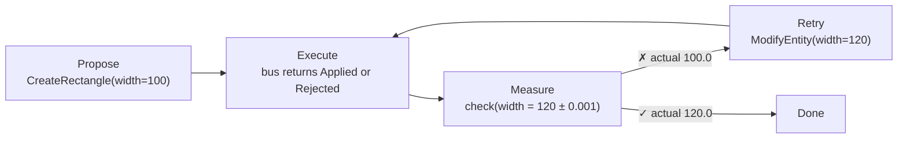
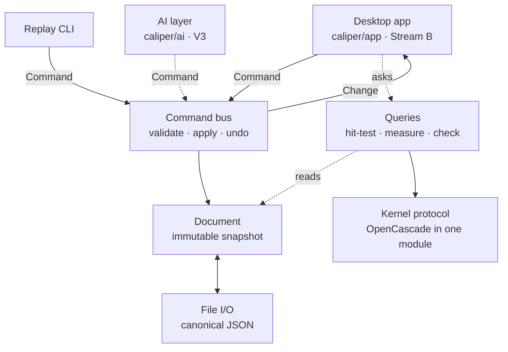

<div align="center">

# Caliper

**CAD that can check its own work.**

An engineering design tool where people, scripts, and AI agents change a part through the same
commands, then measure the result and prove it meets the spec.

[](https://github.com/andrefongkc-cyber/caliper/actions/workflows/core.yml)
[](https://github.com/andrefongkc-cyber/caliper/actions/workflows/app.yml)
[](https://github.com/andrefongkc-cyber/caliper/actions/workflows/boundaries.yml)


</div>

## Why Caliper

Most "text to CAD" tools produce geometry nobody can verify: the model hands back a part and
you check it by eye. Traditional CAD is built around a person clicking, with scripting added
beside it as a second way in.

Caliper is built around a **verification loop** instead. This is the design target; the
engine's `check` query is typed in the contract but not implemented yet.



|  | Typical desktop CAD | Text-to-CAD generators | **Caliper** |
|---|---|---|---|
| Main interface | The GUI; automation is an add-on API | A prompt | **Typed commands and queries; the GUI is one client of them** |
| Who can change a part | Mostly people | The model, once | **People, scripts, and agents, through the same bus** |
| Knowing it's right | Measure by hand | Usually taken on trust | **`check` returns pass or fail plus the measured value** |
| Bad input | Dialogs for a human | Odd geometry | **An error value with a stable code, like `value.not_positive` on `width`** |
| The file | Usually a vendor format | An export | **Canonical JSON with inputs only; replay is byte-identical on any OS** |

## What works today

Caliper is early. V1 is 2D sketching, built by two streams in parallel.

| Area | Status |
|---|---|
| **Desktop app** (macOS, PySide6) | Draw lines, circles, arcs, and rectangles; select; edit sizes in a properties panel; undo and redo with named steps; New, Open, Save |
| **Precision input** | Type exact sizes while drawing, double-click an edge to edit it, ⌘K command palette, keyboard shortcuts sheet (in review: [#5](https://github.com/andrefongkc-cyber/caliper/pull/5)) |
| **Engine** | Every create command and edits with automatic undo, hit-testing and bounding-box queries, canonical save and load with schema migrations |
| **Headless replay** | `python -m caliper.engine replay` turns a command script into a byte-identical `.caliper` file |
| **Not yet** | Move, delete, snapping to points, measuring, dimension values, and `check` itself (the engine raises "not implemented" and the app says so); constraints (V1.5); 3D (V2); any AI (V3) |

The first milestone works end to end: draw a rectangle, change its width to 120, save, reopen,
and it's still 120.

<details>
<summary><b>The ⌘K palette</b>: every command, found by name, with typed fields</summary>
<br>


The list is generated from the engine's own command types, so it is the same vocabulary an AI
tool call would use.
</details>

## Quick start

You need macOS (Linux works for the engine) and [uv](https://docs.astral.sh/uv/getting-started/installation/),
which installs Python 3.13 for you.

```bash
git clone https://github.com/andrefongkc-cyber/caliper.git
cd caliper
uv sync --extra app --group app-test   # engine, desktop app, and test tools
uv run python -m caliper.app           # open the app
```

### Try the engine without a UI

A command script is plain JSON:

```json
{
  "format": "caliper.script",
  "schema_version": 1,
  "commands": [
    {"kind": "create_rectangle", "corner": {"x": 0, "y": 0}, "width": 100, "height": 50},
    {"kind": "modify_entity", "id": "e1", "changes": {"width": 120}}
  ]
}
```

```bash
uv run python -m caliper.engine replay tests/engine/fixtures/milestone.script.json
```

That prints the resulting document: rectangle `e1`, width `120.0`, in canonical JSON that's
identical on every machine.

### Keyboard basics in the app

| Do this | Press |
|---|---|
| Select, Line, Circle, Arc, Rectangle, Dimension, Measure | S, L, C, A, R, D, M |
| Draw an exact rectangle | R, click a corner, type `120` Tab `50` Return |
| Find any command | ⌘K |
| Zoom to fit | F |
| See every shortcut | ⌘/ |

Measure (M), typed sizes, ⌘K, and ⌘/ arrive with [#5](https://github.com/andrefongkc-cyber/caliper/pull/5).

## How it's built



- **One door.** Every change is a typed `Command` sent to the bus. The app, scripts, and a
  future AI agent have exactly the same access.
- **Undo is automatic.** The bus diffs the document before and after; no command writes its
  own inverse.
- **Files store inputs only.** A rectangle is a corner, a width, and a height, never computed
  geometry, so files stay small, diffable, and reproducible.
- **Rules are tested, not just written down.** CI fails if the engine imports Qt, if anything
  besides the kernel module imports OpenCascade, or if a stream's branch touches the other
  stream's files.

Read more in [docs/architecture.md](docs/architecture.md) and the
[decision records](docs/adr/).

| Decision | Choice |
|---|---|
| [0001](docs/adr/0001-geometry-kernel-occt.md) Geometry kernel | OpenCascade (OCCT) behind a swappable protocol |
| [0002](docs/adr/0002-command-bus-and-snapshot-document.md) Changes and undo | Command bus with automatic deltas; snapshot document |
| [0003](docs/adr/0003-constraint-solver-planegcs.md) Constraint solver | planegcs (proposed) |
| [0004](docs/adr/0004-desktop-shell-pyside6-mac-first.md) Desktop app | PySide6, Mac-first |
| [0005](docs/adr/0005-file-format-and-schema-versioning.md) File format | Canonical JSON with schema versions |
| [0006](docs/adr/0006-license-policy-no-gpl.md) Licenses | No GPL or AGPL dependencies |

## Roadmap

| Version | Theme |
|---|---|
| **V1 (now)** | 2D sketching: canvas, shapes, selection, dimensions, save and load. V1.5 adds constraints |
| V2 | Parametric CAD: driving dimensions, extrude, revolve, fillet, 3D parts, assemblies |
| V3 | AI CAD: text or image to CAD, natural-language edits |
| V4 | Simulation: stress, deflection, thermal |
| V5 | Generative design: design, simulate, evaluate, modify, repeat |
| V6+ | Manufacturing, electronics, robotics, test data back into design |

Details in [docs/vision.md](docs/vision.md). Current work is tracked in [WORKPLAN.md](WORKPLAN.md).

## Repository layout

```text
caliper/
  contracts/   types every layer shares: commands, document, queries, errors, kernel
  engine/      headless core: command bus, queries, file I/O, kernels, CLI
  app/         PySide6 desktop app
  ai/          AI tool layer (empty until V3)
bench/         end-to-end cases the AI layer will be measured against
tests/         test suite (tests/app/ runs offscreen with pytest-qt)
docs/          architecture, decision records, workplans, vision
```

## Contributing

Two streams build V1 in parallel: **Stream A** owns the engine and **Stream B** owns the
desktop app. The contract in `caliper/contracts/` is the seam between them. Every pull request
needs the other stream's approval and green CI, starts with a plain-language summary, and is
merged with **Rebase and merge**.

Before pushing, run what CI runs:

```bash
uv run ruff check && uv run ruff format --check && uv run mypy && uv run pytest
```

See [CONTRIBUTING.md](CONTRIBUTING.md) for branches, reviews, and conventions.

## License

No license has been chosen yet; all rights reserved. Dependencies must follow the
[no-GPL policy](docs/adr/0006-license-policy-no-gpl.md).
