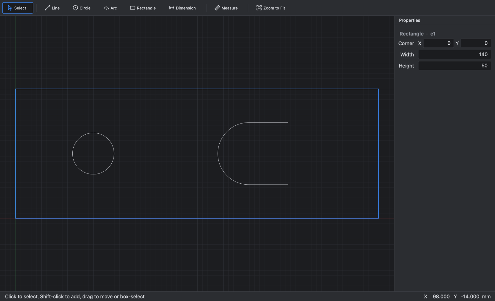
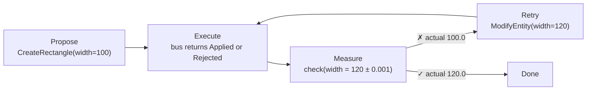
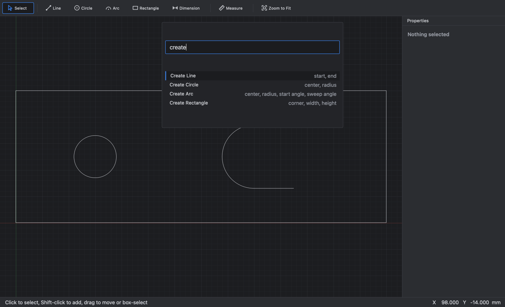
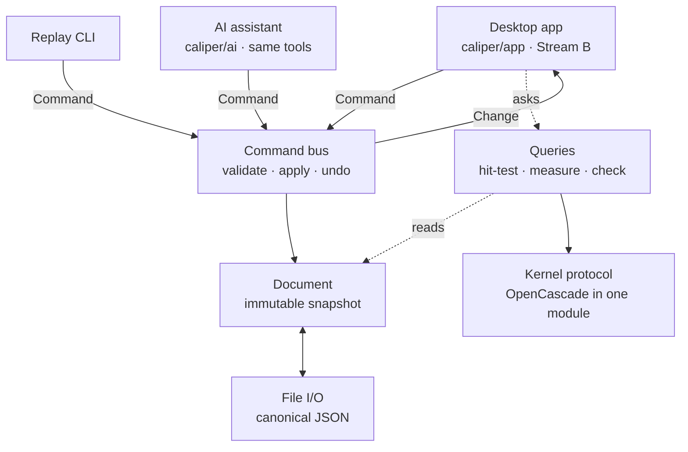

<div align="center">

# Caliper

**CAD that can check its own work.**

An engineering design tool where people, scripts, and AI agents change a part through the same
commands, then measure the result and prove it meets the spec.

[](https://github.com/andrefongkc-cyber/caliper/actions/workflows/core.yml)
[](https://github.com/andrefongkc-cyber/caliper/actions/workflows/app.yml)
[](https://github.com/andrefongkc-cyber/caliper/actions/workflows/boundaries.yml)




</div>

## Why Caliper

Most "text to CAD" tools produce geometry nobody can verify: the model hands back a part and
you check it by eye. Traditional CAD is built around a person clicking, with scripting added
beside it as a second way in.

Caliper is built around a **verification loop** instead, and it works today: `check` returns
pass or fail with the measured value, and the AI assistant uses it to confirm its own changes.



|  | Typical desktop CAD | Text-to-CAD generators | **Caliper** |
|---|---|---|---|
| Main interface | The GUI; automation is an add-on API | A prompt | **Typed commands and queries; the GUI is one client of them** |
| Who can change a part | Mostly people | The model, once | **People, scripts, and agents, through the same bus** |
| Knowing it's right | Measure by hand | Usually taken on trust | **`check` returns pass or fail plus the measured value** |
| Bad input | Dialogs for a human | Odd geometry | **An error value with a stable code, like `value.not_positive` on `width`** |
| The file | Usually a vendor format | An export | **Canonical JSON with inputs only; replay is byte-identical on any OS** |

## What works today

Caliper is early: 2D sketching with constraints is done (V1 and V1.5), and Claude can work
in it two ways, as the in-app assistant or from Claude Desktop over MCP. 3D is next.

| Area | Status |
|---|---|
| **Desktop app** (macOS, PySide6) | Draw lines, circles, arcs, and rectangles; fillet corners; select, box-select, move, and delete; type exact sizes while drawing; alignment snapping; measure; ⌘K command palette; undo and redo with named steps; New, Open, Save |
| **Constraints and dimensions** | Our own solver ([ADR 0008](docs/adr/0008-constraint-solver-our-own.md)): coincident, horizontal, vertical, parallel, perpendicular, tangent, equal, midpoint, symmetric, concentric, fix, and more; driving and driven distance, radius, diameter, and angle dimensions; degrees of freedom shown live; conflicts and redundancies named, never guessed |
| **Checks** | `check` measures distances, positions, bounding boxes, area, and dimension values against a tolerance, and the Checks panel keeps yours |
| **Headless** | `python -m caliper.engine replay` turns a command script into a byte-identical `.caliper` file; `inspect` and `export` too |
| **AI assistant** | In the prompt bar: Claude through the Anthropic API (opt-in), working through 21 tools made from Caliper's own commands and queries. Its changes arrive as a proposal you accept as one undo step ([#32](https://github.com/andrefongkc-cyber/caliper/pull/32)) |
| **Claude Desktop over MCP** | Claude Desktop drives the open Caliper window through the same tools, with no API key, and you accept its proposals in Caliper. Setup: [docs/mcp.md](docs/mcp.md) ([#34](https://github.com/andrefongkc-cyber/caliper/pull/34), fixes in [#35](https://github.com/andrefongkc-cyber/caliper/pull/35)) |
| **Not yet** | 3D parts (V2), simulation (V4), and everything after |

## Recent findings: Claude builds real parts

The first stress tests ran Claude Desktop against Caliper over MCP, with every change validated
by Caliper and accepted by a person.

- **A fully constrained test plate:** 400 × 250 mm with R25 corners, two U-cutouts with R20
  bottoms, two side notches, nine holes, and two slots, symmetric about both axes. That's
  187 entities, 121 constraints, and 18 driving dimensions, with **0 degrees of freedom and
  57 of 57 checks passing**.
- **Design intent held:** resizing a smaller part by changing two driving dimensions moved
  every hole with its corner and kept the symmetry.
- **Bad input was refused** with Caliper's own errors, such as `value.not_positive` for a
  radius of −5.

The tests found three problems, fixed in [#35](https://github.com/andrefongkc-cyber/caliper/pull/35):

| Found | Cause | Fix |
|---|---|---|
| A fillet's tangent constraint was rejected as redundant | At the joint, "centre is *r* from the line" has the same first-order gradient as the joint itself | Tangency at a joint is written as the radius being perpendicular to the line |
| Large proposals slowed to a crawl, and checks timed out | Every change replayed all pending commands (224 changes: 5 s a call, 277 s in all) | The proposal reuses the draft's own document: 128 changes went from 20.3 s to 0.69 s |
| The proposal card grew past the window | It listed every change | Over 6 changes, it shows a summary line and a collapsible, scrolling list |

Still open:
- Checks run while no proposal is pending don't reach the Checks panel.
- Accepting a very large proposal takes about 10 s. That's the solver, and it's the next
  performance work.
- Solver round-off (like `8.6e-78` for zero) is saved in files.
- Tangency through a point in between, or to a rectangle's side, still uses the old form.

<details>
<summary><b>The ⌘K palette</b>: every command, found by name, with typed fields</summary>
<br>


The list is generated from the engine's own command types, so it is the same vocabulary an AI
tool call would use.
</details>

## Quick start

You need macOS (Linux works for the engine) and [uv](https://docs.astral.sh/uv/getting-started/installation/),
which installs Python 3.13 for you.

```bash
git clone https://github.com/andrefongkc-cyber/caliper.git
cd caliper
uv sync --extra app --group app-test   # engine, desktop app, and test tools
uv run python -m caliper.app           # open the app
```

To try the in-app assistant, install the `ai` extra and put your Anthropic key in your shell,
never in a file in the repo:

```bash
uv sync --extra app --extra ai --group app-test
CALIPER_ASSISTANT=claude uv run python -m caliper.app
```

Claude Desktop over MCP needs no key: [docs/mcp.md](docs/mcp.md) shows how to connect it, and
has a step-by-step test.

### Try the engine without a UI

A command script is plain JSON:

```json
{
  "format": "caliper.script",
  "schema_version": 1,
  "commands": [
    {"kind": "create_rectangle", "corner": {"x": 0, "y": 0}, "width": 100, "height": 50},
    {"kind": "modify_entity", "id": "e1", "changes": {"width": 120}}
  ]
}
```

```bash
uv run python -m caliper.engine replay tests/engine/fixtures/milestone.script.json
```

That prints the resulting document: rectangle `e1`, width `120.0`, in canonical JSON that's
identical on every machine.

### Keyboard basics in the app

| Do this | Press |
|---|---|
| Select, Line, Circle, Arc, Rectangle | S, L, C, A, R |
| Dimension, Measure, Constrain, Fillet | D, M, K, O |
| Draw an exact rectangle | R, click a corner, type `120` Tab `50` Return |
| Find any command | ⌘K |
| Zoom to fit | F |
| Ask the assistant | ⌘L, then Accept with ⌘Return |
| See every shortcut | ⌘/ |

## How it's built



- **One door.** Every change is a typed `Command` sent to the bus. The app, scripts, and the
  AI assistant have exactly the same access, and the assistant's changes are proposals until
  a person accepts them.
- **Undo is automatic.** The bus diffs the document before and after; no command writes its
  own inverse.
- **Files store inputs only.** A rectangle is a corner, a width, and a height, never computed
  geometry, so files stay small, diffable, and reproducible.
- **Rules are tested, not just written down.** CI fails if the engine imports Qt, if anything
  besides the kernel module imports OpenCascade, or if a stream's branch touches the other
  stream's files.

Read more in [docs/architecture.md](docs/architecture.md) and the
[decision records](docs/adr/).

| Decision | Choice |
|---|---|
| [0001](docs/adr/0001-geometry-kernel-occt.md) Geometry kernel | OpenCascade (OCCT) behind a swappable protocol |
| [0002](docs/adr/0002-command-bus-and-snapshot-document.md) Changes and undo | Command bus with automatic deltas; snapshot document |
| [0008](docs/adr/0008-constraint-solver-our-own.md) Constraint solver | Our own, in Python (replaced planegcs, [0003](docs/adr/0003-constraint-solver-planegcs.md)) |
| [0004](docs/adr/0004-desktop-shell-pyside6-mac-first.md) Desktop app | PySide6, Mac-first |
| [0005](docs/adr/0005-file-format-and-schema-versioning.md) File format | Canonical JSON with schema versions |
| [0006](docs/adr/0006-license-policy-no-gpl.md) Licenses | No GPL or AGPL dependencies |
| [0009](docs/adr/0009-sketch-constraints-in-the-document.md) Constraints | Stored in the document, solved inside the command that changes them |

## Roadmap

| Version | Theme |
|---|---|
| **V1, V1.5 (done)** | 2D sketching: canvas, shapes, selection, save and load; constraints and dimensions |
| V2 | Parametric CAD: driving dimensions, extrude, revolve, fillet, 3D parts, assemblies |
| V3 | AI CAD: text or image to CAD, natural-language edits. The foundation is in early: an assistant and MCP over the same tools |
| V4 | Simulation: stress, deflection, thermal |
| V5 | Generative design: design, simulate, evaluate, modify, repeat |
| V6+ | Manufacturing, electronics, robotics, test data back into design |

Details in [docs/vision.md](docs/vision.md). Current work is tracked in [WORKPLAN.md](WORKPLAN.md).

## Repository layout

```text
caliper/
  contracts/   types every layer shares: commands, document, queries, errors, kernel
  engine/      headless core: command bus, queries, file I/O, kernels, CLI
  app/         PySide6 desktop app
  ai/          the assistant: tools over commands and queries, the Claude adapter, the loop
bench/         end-to-end cases the AI is measured against
tests/         test suite (tests/app/ runs offscreen with pytest-qt)
docs/          architecture, decision records, workplans, vision
```

## Contributing

Two streams build V1 in parallel: **Stream A** owns the engine and **Stream B** owns the
desktop app. The contract in `caliper/contracts/` is the seam between them. Every pull request
needs the other stream's approval and green CI, starts with a plain-language summary, and is
merged with **Rebase and merge**. The AI layer (`caliper/ai/`) is Andre's, on `ai/<topic>`
branches; changes that cross areas go on `shared/<topic>` branches.

Before pushing, run what CI runs:

```bash
uv run ruff check && uv run ruff format --check && uv run mypy && uv run pytest
```

See [CONTRIBUTING.md](CONTRIBUTING.md) for branches, reviews, and conventions.

## License

No license has been chosen yet; all rights reserved. Dependencies must follow the
[no-GPL policy](docs/adr/0006-license-policy-no-gpl.md).
