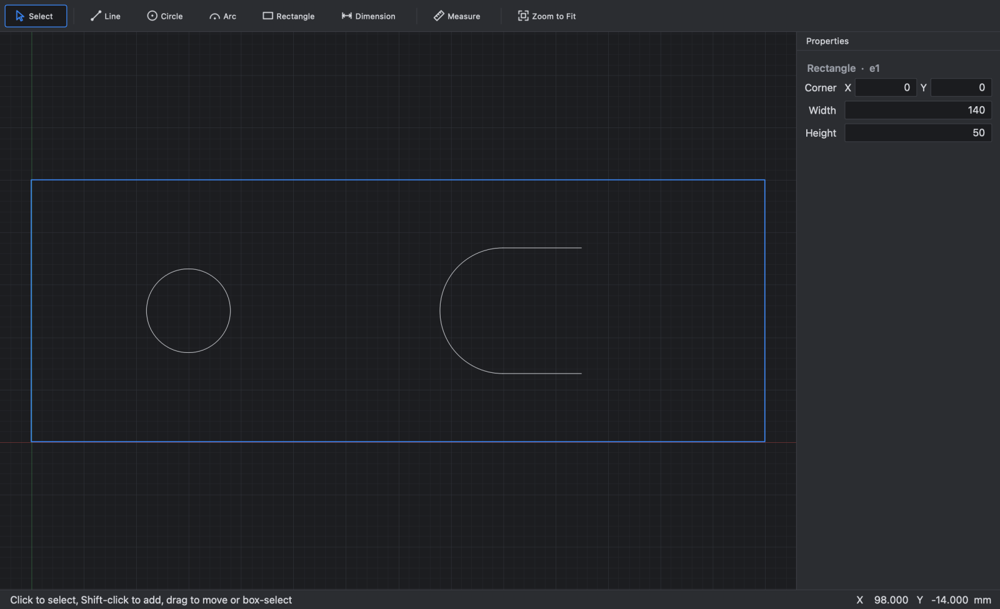
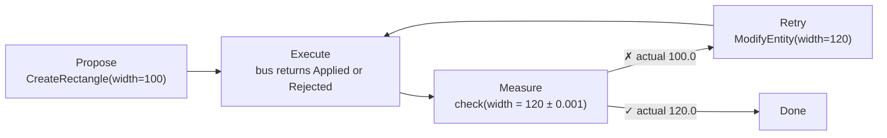
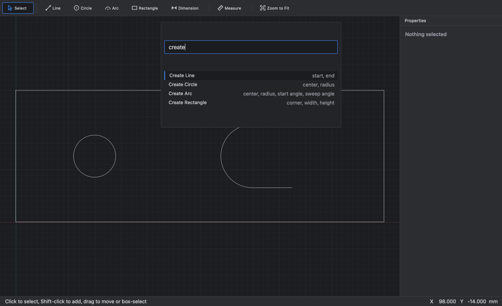
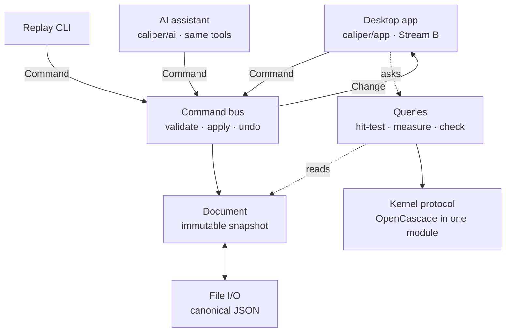

<div align="center">

# Caliper

**CAD that can check its own work.**

An engineering design tool where people, scripts, and AI agents change a part through the same
commands, then measure the result and prove it meets the spec.

[](https://github.com/andrefongkc-cyber/caliper/actions/workflows/core.yml)
[](https://github.com/andrefongkc-cyber/caliper/actions/workflows/app.yml)
[](https://github.com/andrefongkc-cyber/caliper/actions/workflows/boundaries.yml)




</div>

## Why Caliper

Most "text to CAD" tools produce geometry nobody can verify: the model hands back a part and
you check it by eye. Traditional CAD is built around a person clicking, with scripting added
beside it as a second way in.

Caliper is built around a **verification loop** instead, and it works today: `check` returns
pass or fail with the measured value, and the AI assistant uses it to confirm its own changes.


```mermaid
flowchart LR
    A["Propose<br/>CreateRectangle(width=100)"] --> B["Execute<br/>bus returns Applied or Rejected"]
    B --> C["Measure<br/>check(width = 120 ± 0.001)"]
    C -->|"✗ actual 100.0"| D["Retry<br/>ModifyEntity(width=120)"]
    D --> B
    C -->|"✓ actual 120.0"| E["Done"]
```

|  | Typical desktop CAD | Text-to-CAD generators | **Caliper** |
|---|---|---|---|
| Main interface | The GUI; automation is an add-on API | A prompt | **Typed commands and queries; the GUI is one client of them** |
| Who can change a part | Mostly people | The model, once | **People, scripts, and agents, through the same bus** |
| Knowing it's right | Measure by hand | Usually taken on trust | **`check` returns pass or fail plus the measured value** |
| Bad input | Dialogs for a human | Odd geometry | **An error value with a stable code, like `value.not_positive` on `width`** |
| The file | Usually a vendor format | An export | **Canonical JSON with inputs only; replay is byte-identical on any OS** |

## What works today

Caliper is early: 2D sketching with constraints is done (V1 and V1.5), and Claude can work
in it two ways, as the in-app assistant or from Claude Desktop over MCP. 3D is next.

| Area | Status |
|---|---|
| **Desktop app** (macOS, PySide6) | Draw lines, circles, arcs, and rectangles; fillet corners; select, box-select, move, and delete; type exact sizes while drawing; alignment snapping; measure; ⌘K command palette; undo and redo with named steps; New, Open, Save |
| **Constraints and dimensions** | Our own solver ([ADR 0008](docs/adr/0008-constraint-solver-our-own.md)): coincident, horizontal, vertical, parallel, perpendicular, tangent (including at fillet and slot joints), equal, midpoint, symmetric, concentric, fix, normal, and curvature; driving and driven distance, radius, diameter, and angle dimensions; constraints and dimensions can be edited, re-pointed, and removed after the fact; degrees of freedom shown live; conflicts and redundancies refused and named, never guessed |
| **Repeating geometry** | Three AI tools, each one call made of Caliper's own commands: `mirror_entities` (about a line), `linear_pattern` (rows and grids), and `circular_pattern` (round a centre), for points, lines, circles, and arcs. Each copy is tied to its original by constraints, so editing the original, the mirror line, or the one spacing dimension updates every copy |
| **Drawing in fewer calls** | `create_outline` draws a traced outline of lines and arcs, joined and optionally tangent, in one call; `create_arc_through_points` works out an arc from three points |
| **Checks** | `check` measures distances, positions, bounding boxes, area, and dimension values against a tolerance. Area takes any closed outline of lines and arcs, with holes. Checks are saved in the file with the part, edited from the Checks panel (Return), and adding, editing, or removing one is undone like any change ([ADR 0010](docs/adr/0010-checks-in-the-document.md)) |
| **Headless** | `python -m caliper.engine replay` turns a command script into a byte-identical `.caliper` file; `inspect` and `export` too |
| **AI assistant** | In the prompt bar: Claude through the Anthropic API (opt-in), working through 27 tools made from Caliper's own commands and queries. Its changes arrive as a proposal you accept as one undo step ([#32](https://github.com/andrefongkc-cyber/caliper/pull/32)) |
| **Claude Desktop over MCP** | Claude Desktop drives the open Caliper window through the same tools, with no API key, and you accept its proposals in Caliper. The Timing panel times each task and shows the time left. Setup: [docs/mcp.md](docs/mcp.md) ([#34](https://github.com/andrefongkc-cyber/caliper/pull/34), fixes in [#35](https://github.com/andrefongkc-cyber/caliper/pull/35)) |
| **Performance** | Only what a change reaches is solved again, and Accept commits what the proposal already solved: the 281-call stress plate costs Caliper under 1 s in all, and Accept 0.02 s (Performance V2, [#47](https://github.com/andrefongkc-cyber/caliper/pull/47)) |
| **V2, started** | A document is one part: sketches placed on the XY, XZ, or YZ plane, in order, with V1 files migrated into one sketch on XY (file schema 4, [ADR 0011](docs/adr/0011-a-part-of-ordered-features-and-sketches-on-planes.md)). An extrude adds a sketch's profile to the part's solid, or cuts it away, and volume checks measure it. The solid is worked out again only where a change reaches it, and never stored ([ADR 0013](docs/adr/0013-solids-extrude-and-recomputing-only-what-changed.md)): 120 x 50 extruded 10 mm is 60,000 mm³, widened to 140 it's 70,000, and undo brings back 60,000 |
| **Not yet** | Extrude and 3D parts (V2), simulation (V4), and everything after |

## What the test runs found

Every Claude task in Caliper is validated by Caliper and accepted by a person. The runs by hand
are recorded in [test-runs-andre/](test-runs-andre/).

- **A fully constrained stress-test plate** (240 × 160 mm, R12 fillets, two slots, a 5 × 4
  hole grid, a D cutout, a 12-point star, a Ø0.2 hole): **0 degrees of freedom, 12 of 12
  checks passing**. The second rerun, with the mirror and pattern tools, took **4m 40s and
  162 calls, against 9m 17s and 281** for the first.
- **Design intent held:** resizing a part through its driving dimensions moved every hole
  with the edge it's measured from and kept the symmetry.
- **Bad input was refused** with Caliper's own errors, such as `value.not_positive` for a
  radius of −5.

What the runs found and what fixed it: tangency at a fillet joint ([#35](https://github.com/andrefongkc-cyber/caliper/pull/35)),
large proposals replaying every command ([#35](https://github.com/andrefongkc-cyber/caliper/pull/35)),
a 25 s Accept and slow calls (Performance V2), and tangency to a rectangle's side (C-2).

Known limitations today, all in [docs/known-issues.md](docs/known-issues.md):
- An edit that moves a large, tightly joined shape takes tens of milliseconds (C-6).
- MCP needs macOS or Linux (AI-8).
- A slot drawn as a rectangle with end arcs has no area; drawn as one outline, it does (C-13).
- The in-app assistant hasn't been run against the live Claude API; Claude Desktop over MCP
  needs no key and is the tested way in (AI-6).

<details>
<summary><b>The ⌘K palette</b>: every command, found by name, with typed fields</summary>
<br>


The list is generated from the engine's own command types, so it is the same vocabulary an AI
tool call would use.
</details>

## Quick start

You need macOS (Linux works for the engine) and [uv](https://docs.astral.sh/uv/getting-started/installation/),
which installs Python 3.13 for you.

```bash
git clone https://github.com/andrefongkc-cyber/caliper.git
cd caliper
uv sync --extra app --group app-test   # engine, desktop app, and test tools
uv run python -m caliper.app           # open the app
```

To try the in-app assistant, install the `ai` extra and put your Anthropic key in your shell,
never in a file in the repo:

```bash
uv sync --extra app --extra ai --group app-test
CALIPER_ASSISTANT=claude uv run python -m caliper.app
```

Claude Desktop over MCP needs no key: [docs/mcp.md](docs/mcp.md) shows how to connect it, and
has a step-by-step test.

### Try the engine without a UI

A command script is plain JSON:

```json
{
  "format": "caliper.script",
  "schema_version": 1,
  "commands": [
    {"kind": "create_rectangle", "corner": {"x": 0, "y": 0}, "width": 100, "height": 50},
    {"kind": "modify_entity", "id": "e1", "changes": {"width": 120}}
  ]
}
```

```bash
uv run python -m caliper.engine replay tests/engine/fixtures/milestone.script.json
```

That prints the resulting document: rectangle `e1`, width `120.0`, in canonical JSON that's
identical on every machine.

### Keyboard basics in the app

| Do this | Press |
|---|---|
| Select, Line, Circle, Arc, Rectangle | S, L, C, A, R |
| Dimension, Measure, Constrain, Fillet | D, M, K, O |
| Draw an exact rectangle | R, click a corner, type `120` Tab `50` Return |
| Find any command | ⌘K |
| Zoom to fit | F |
| Ask the assistant | ⌘L, then Accept with ⌘Return |
| See every shortcut | ⌘/ |

## How it's built


```mermaid
flowchart TD
    UI["Desktop app<br/>caliper/app · Stream B"] -- Command --> BUS
    CLI["Replay CLI"] -- Command --> BUS
    AI["AI assistant<br/>caliper/ai · same tools"] -- Command --> BUS
    BUS["Command bus<br/>validate · apply · undo"] --> DOC["Document<br/>immutable snapshot"]
    BUS -- Change --> UI
    Q["Queries<br/>hit-test · measure · check"] -. reads .-> DOC
    UI -. asks .-> Q
    DOC <--> IO["File I/O<br/>canonical JSON"]
    Q --> K["Kernel protocol<br/>OpenCascade in one module"]
```

- **One door.** Every change is a typed `Command` sent to the bus. The app, scripts, and the
  AI assistant have exactly the same access, and the assistant's changes are proposals until
  a person accepts them.
- **Undo is automatic.** The bus diffs the document before and after; no command writes its
  own inverse.
- **Files store inputs only.** A rectangle is a corner, a width, and a height, never computed
  geometry, so files stay small, diffable, and reproducible.
- **Constraints are solved inside the command that changes them**, and only what a change
  reaches: geometry joined by constraints forms clusters, and entities a change left alone
  are the same objects, so everything derived from them (clusters, status, checks) is kept.
  A command the constraints can't allow is refused, naming the constraints in the way.
- **Rules are tested, not just written down.** CI fails if the engine imports Qt, if anything
  besides the kernel module imports OpenCascade, or if a stream's branch touches the other
  stream's files.

Read more in [docs/architecture.md](docs/architecture.md) and the
[decision records](docs/adr/).

| Decision | Choice |
|---|---|
| [0001](docs/adr/0001-geometry-kernel-occt.md) Geometry kernel | OpenCascade (OCCT) behind a swappable protocol |
| [0002](docs/adr/0002-command-bus-and-snapshot-document.md) Changes and undo | Command bus with automatic deltas; snapshot document |
| [0008](docs/adr/0008-constraint-solver-our-own.md) Constraint solver | Our own, in Python (replaced planegcs, [0003](docs/adr/0003-constraint-solver-planegcs.md)) |
| [0004](docs/adr/0004-desktop-shell-pyside6-mac-first.md) Desktop app | PySide6, Mac-first |
| [0005](docs/adr/0005-file-format-and-schema-versioning.md) File format | Canonical JSON with schema versions |
| [0006](docs/adr/0006-license-policy-no-gpl.md) Licenses | No GPL or AGPL dependencies |
| [0009](docs/adr/0009-sketch-constraints-in-the-document.md) Constraints | Stored in the document, solved inside the command that changes them |
| [0010](docs/adr/0010-checks-in-the-document.md) Checks (proposed) | Stored in the document, changed by commands like everything else |
| [0011](docs/adr/0011-a-part-of-ordered-features-and-sketches-on-planes.md) The part (proposed) | A document is one part: features in order, sketches on planes (V2's first step) |
| [0013](docs/adr/0013-solids-extrude-and-recomputing-only-what-changed.md) Solids (proposed) | Extrude as the first feature; solids worked out again only where something changed, never stored |

## Roadmap

| Version | Theme |
|---|---|
| **V1, V1.5 (done)** | 2D sketching: canvas, shapes, selection, save and load; constraints and dimensions |
| V2 | Parametric CAD: driving dimensions, extrude, revolve, fillet, 3D parts, assemblies |
| V3 | AI CAD: text or image to CAD, natural-language edits. The foundation is in early: an assistant and MCP over the same tools |
| V4 | Simulation: stress, deflection, thermal |
| V5 | Generative design: design, simulate, evaluate, modify, repeat |
| V6+ | Manufacturing, electronics, robotics, test data back into design |

Details in [docs/vision.md](docs/vision.md). Current work is tracked in [WORKPLAN.md](WORKPLAN.md).

## Repository layout

```text
caliper/
  contracts/   types every layer shares: commands, document, queries, errors, kernel
  engine/      headless core: command bus, queries, file I/O, kernels, CLI
  app/         PySide6 desktop app
  ai/          the assistant: tools over commands and queries, the Claude adapter, the loop
bench/         benchmarks: end-to-end cases, recorded Claude sessions, solver numerics
tests/         test suite (tests/app/ runs offscreen with pytest-qt)
docs/          architecture, decision records, workplans, known issues, MCP setup
test-runs-andre/  records of the Claude tests run by hand
```

## Contributing

Two streams build V1 in parallel: **Stream A** owns the engine and **Stream B** owns the
desktop app. The contract in `caliper/contracts/` is the seam between them. Every pull request
needs the other stream's approval and green CI, starts with a plain-language summary, and is
merged with **Rebase and merge**. The AI layer (`caliper/ai/`) is Andre's, on `ai/<topic>`
branches; changes that cross areas go on `shared/<topic>` branches.

### Tests and benchmarks

- **`tests/`** runs with `uv run pytest`: unit tests for every command, constraint, dimension,
  and query; property tests (Hypothesis) over random constrained sketches and command
  sequences; a reference solver (`sketch.reference()`, the solver before its optimizations)
  that the fast one must match; and the app, driven offscreen with pytest-qt.
- **`bench/perf.py`** replays recorded Claude Desktop sessions (`bench/sessions/`) with and
  without the window, plus synthetic large cases and the repeat tools; `--save` and
  `--compare` track changes. Saved runs are in `bench/results/`.
- **`bench/numerics.py`** runs every recorded command through the fast solver and the
  reference from the same document and fails on any significant difference.
- **`bench/run.py`** checks each case in `bench/cases/` (a prompt, its expectations, and a
  known-good command script) end to end, the harness an AI solver will be measured by.

Before pushing, run what CI runs:

```bash
uv run ruff check && uv run ruff format --check && uv run mypy && uv run pytest
```

See [CONTRIBUTING.md](CONTRIBUTING.md) for branches, reviews, and conventions.

## License

No license has been chosen yet; all rights reserved. Dependencies must follow the
[no-GPL policy](docs/adr/0006-license-policy-no-gpl.md).
