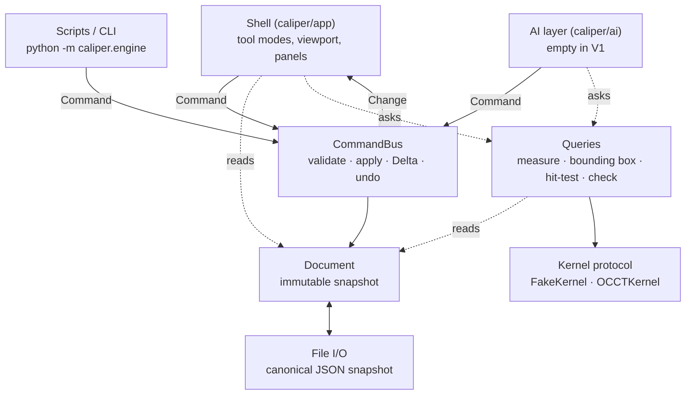
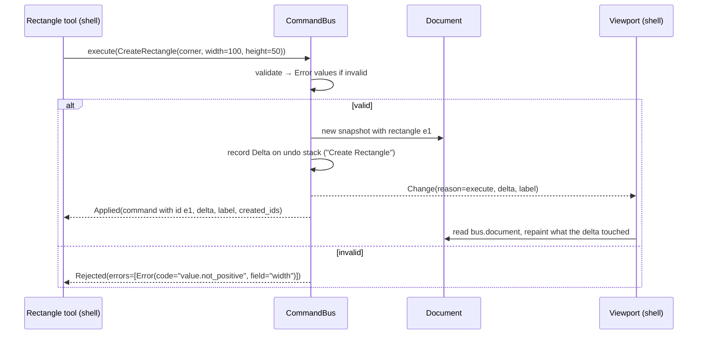

# Architecture

How Caliper is put together. The decisions behind it live in [`docs/adr/`](adr/); this
document explains how the pieces fit.

## The idea in one paragraph

Most "text to CAD" tools emit geometry nobody can check. Caliper is built around a
**verification loop**: an agent, a script, or a person makes a change through a command,
then measures, queries, and asserts against the resulting geometry, and retries if it's
wrong. Everything below exists to make that loop reliable. There is one way to change a
document, one way to ask about it, and a file format that reproduces exactly.

## Layers

The shell, the AI layer, and scripts are **peers**. Each one builds the same `Command`
objects and sends them to the same bus. The AI has no private access; if it needs something
the UI doesn't have, the contract is missing something.

## Packages and what may import what

| Package | Contains | May import | Must never import |
|---|---|---|---|
| `caliper/contracts/` | Types and protocols shared by everyone | standard library only | anything else |
| `caliper/engine/` | Bus, document operations, queries, file I/O, kernels, CLI | `contracts` | `app`, `ai`, Qt, OS-specific modules; `OCP` outside `geometry/occt_kernel.py` |
| `caliper/ai/` | Tool adapter over commands and queries (V3) | `contracts`, `engine` | `app` |
| `caliper/app/` | PySide6 shell | `contracts`, `engine` | kernels (`engine/geometry/`) |

These rules are tested, not just documented: see `tests/test_architecture.py`.

## How a change flows

Things worth noticing:

- **Invalid input is a value, not an exception.** `Rejected` says exactly which field was
  wrong and why, with a stable error code an agent can act on. An exception means a bug.
- **Nobody writes undo code.** The bus compares entity values before and after and keeps the
  `Delta`; undo applies it in reverse.
- **The document is immutable.** The shell can hold a snapshot while it paints without it
  changing underneath.
- **Previews aren't commands.** While you drag out a rectangle, the rubber band is shell
  state. One command is sent on release. Selection and hover are shell state too.

Grouping works the same way for every caller. `with bus.transaction("Add Mounting Holes"):`
turns many commands into one undo step, and an optimizer can run thousands of commands
without growing the undo stack.

## The three records

| Record | Where it lives | Saved? |
|---|---|---|
| **Document** | `bus.document` | Yes: the `.caliper` file |
| **Undo stack** | inside the bus | No: session only, bounded |
| **AI/session transcript** | sidecar file (with the AI layer) | Never inside the project file |

Keeping these separate is deliberate (ADR 0002). Project files get sent to suppliers, and
the design's history of "what someone tried" must not travel with the part.

## Reading geometry: queries

`bus.queries` answers questions about the current snapshot:

- `feature_point`
- `measure_distance`
- `bounding_box`
- `entity_at_point`
- `entities_in_box`
- `nearest_feature`
- `dimension_value`
- `area_properties`
- `check`

`check(Expectation(...))` is the verification loop in its smallest form. It takes a numeric
claim (for example "distance between these two features is 120 ± 0.001") and returns a
`CheckResult` with the actual value. Bench cases, tests, and the future AI layer all use it.

2D sketch queries are plain math. The **kernel** is used only for real solid-modeling work,
such as turning a closed profile into a face to get its area properties. Two kernels
implement the same provisional protocol:

- `FakeKernel`: analytic, used in tests.
- `OCCTKernel`: OpenCascade, behind the optional `occt` extra.

One conformance suite runs against both, so they can't drift apart.

## Files

A `.caliper` file is a **snapshot** of the document as canonical JSON (ADR 0005):

- **Canonical encoding:** sorted keys, fixed indentation, Python's round-trip float
  formatting, `\n` line endings everywhere.
- **Inputs only:** a rectangle is stored as corner, width, and height. Nothing computed
  (arc endpoints, measured dimension values, kernel output) is stored.
- **Versioned:** a `schema_version` plus a migration chain.

That combination makes replay meaningful. `python -m caliper.engine replay script.json` runs
commands with no UI and must produce a byte-identical file on any OS. It also makes the file
declarative, which is the shape the V2 parametric feature tree needs.

## Invariants

| # | Invariant | Enforced by |
|---|---|---|
| 1 | `contracts/` and `engine/` never import `app/`, `ai/`, Qt, or OS-specific modules | `tests/test_architecture.py`; engine CI runs on Linux |
| 2 | Every state change is a `Command` sent to the bus | Immutable `Document`; review |
| 3 | Commands are typed, validated by the bus, serializable, and undoable via an automatic `Delta` | `tests/contracts/`; bus tests |
| 4 | Every command works headlessly; replay produces byte-identical files | Replay tests (Phase 0 step 6) |
| 5 | The AI layer uses the same commands and queries as the UI | Package rules above |
| 6 | Queries and assertions are designed alongside commands | `contracts/queries.py` |
| 7 | OCCT specifics stay behind the `Kernel` protocol; only `occt_kernel.py` imports `OCP` | `tests/test_architecture.py` |
| 8 | Project files store inputs only, never derived values | ADR 0005; I/O tests |

## Working in parallel

Two streams build V1 at the same time, each in its own git worktree:

| Stream | Owns | Branches |
|---|---|---|
| A: Core | `caliper/engine/`, `bench/`, `tests/` (except `tests/app/`) | `stream/core[/topic]` |
| B: Shell | `caliper/app/`, `tests/app/` | `stream/shell[/topic]` |

The contract is the seam between them. After the Phase 0.5 spike, `commands.py`,
`document.py`, `queries.py`, and `errors.py` freeze. Changing them takes a `contracts/`
branch reviewed by both people. `kernel.py` stays provisional.

Two layers keep the streams apart:

1. **The `boundaries` CI check** fails a stream branch that touches the other stream's files.
2. **Code-owner review:** the other person must approve every PR.

See [CONTRIBUTING.md](../CONTRIBUTING.md) for the day-to-day workflow.

## Testing

- **`tests/test_architecture.py`, `tests/test_boundaries.py`, `tests/test_licenses.py`:**
  repository rules.
- **`tests/contracts/`:** keeps the contract self-consistent.
- **`tests/engine/`:** engine behavior, with hypothesis property tests for geometry.
  `tests/engine/geometry/test_kernel_conformance.py` runs against every available kernel.
- **`tests/app/`:** pytest-qt, run offscreen on macOS CI.
- **`bench/`:** end-to-end cases (a prompt or script, a reference model, and expectations).
  It exists before the AI layer so the AI has something to be measured against from day one.

## Deliberately not here

Simulation, manufacturing, electronics, robotics, and 3D are out of scope for V1. There are
no hooks or plugin points for them. Where they're headed is in [vision.md](vision.md);
building for them now would be guessing.
