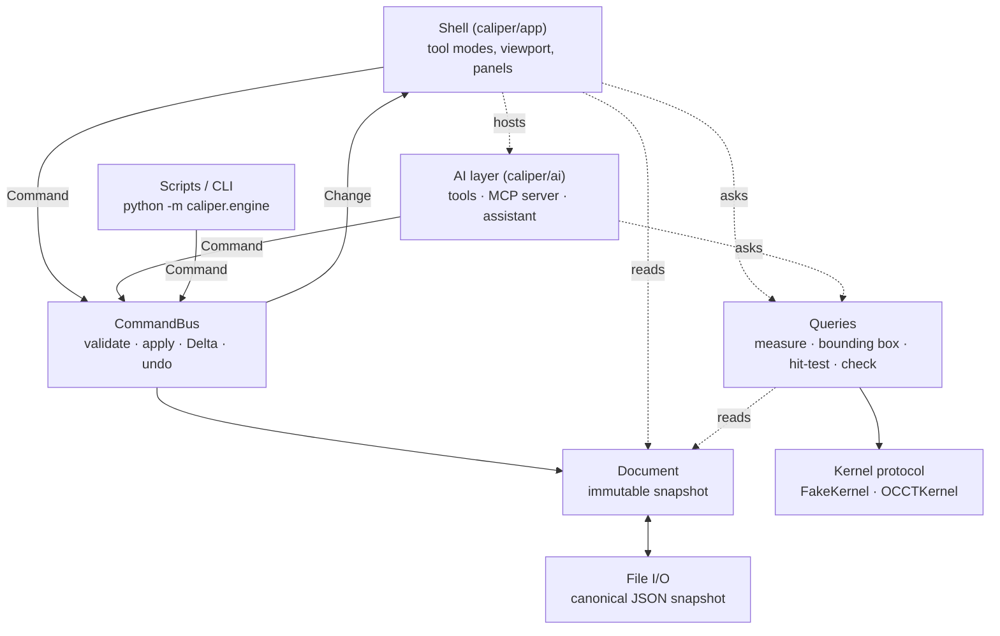
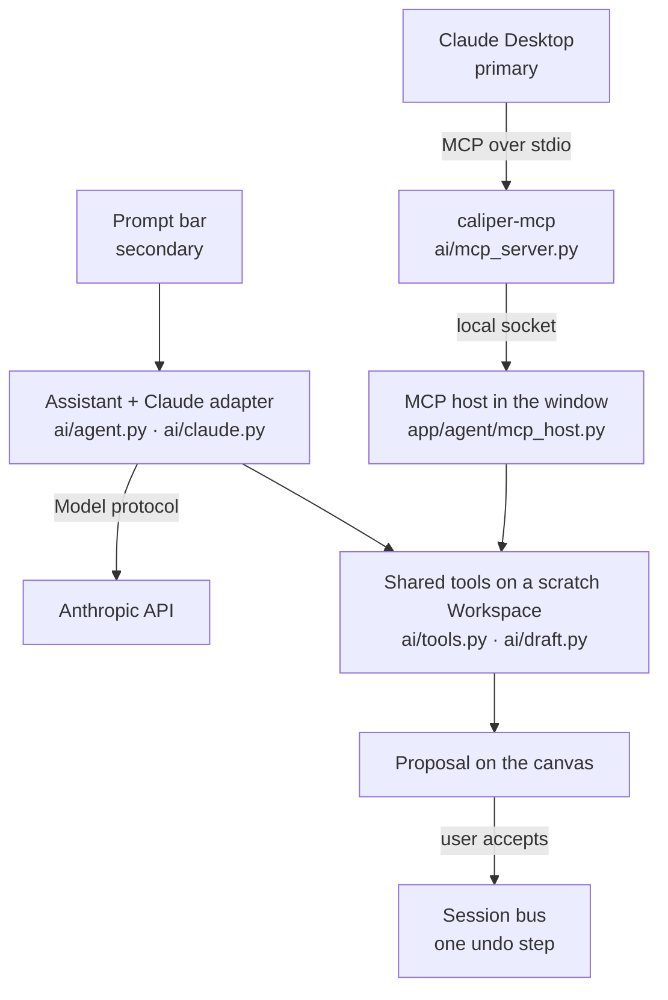
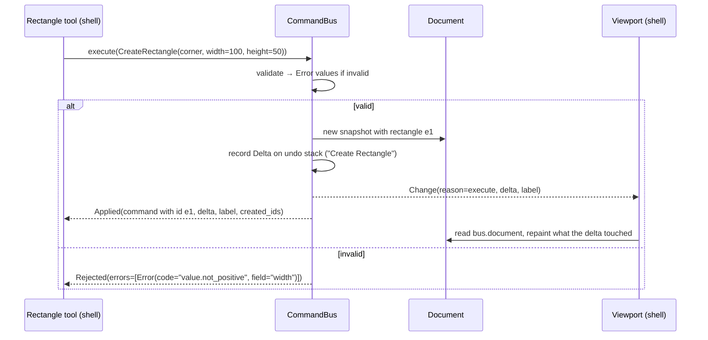

# Architecture

How Caliper is put together. The decisions behind it live in [`docs/adr/`](adr/); this
document explains how the pieces fit.

## The idea in one paragraph

Most "text to CAD" tools emit geometry nobody can check. Caliper is built around a
**verification loop**: an agent, a script, or a person makes a change through a command,
then measures, queries, and asserts against the resulting geometry, and retries if it's
wrong. Everything below exists to make that loop reliable. There is one way to change a
document, one way to ask about it, and a file format that reproduces exactly.

## Layers

```mermaid
flowchart TD
    UI["Shell (caliper/app)<br/>tool modes, viewport, panels"]
    AI["AI layer (caliper/ai)<br/>tools · MCP server · assistant"]
    CLI["Scripts / CLI<br/>python -m caliper.engine"]
    BUS["CommandBus<br/>validate · apply · Delta · undo"]
    DOC["Document<br/>immutable snapshot"]
    Q["Queries<br/>measure · bounding box · hit-test · check"]
    K["Kernel protocol<br/>FakeKernel · OCCTKernel"]
    IO["File I/O<br/>canonical JSON snapshot"]

    UI -- Command --> BUS
    AI -- Command --> BUS
    CLI -- Command --> BUS
    UI -. hosts .-> AI
    BUS --> DOC
    BUS -- Change --> UI
    UI -. reads .-> DOC
    UI -. asks .-> Q
    AI -. asks .-> Q
    Q -. reads .-> DOC
    Q --> K
    DOC <--> IO
```

The shell, the AI layer, and scripts are **peers**. Each one builds the same `Command`
objects and sends them to the same bus. The AI has no private access; if it needs something
the UI doesn't have, the contract is missing something.

## The AI layer: two ways in, one set of tools

```mermaid
flowchart TD
    CD["Claude Desktop<br/>primary"]
    SRV["caliper-mcp<br/>ai/mcp_server.py"]
    HOST["MCP host in the window<br/>app/agent/mcp_host.py"]
    BAR["Prompt bar<br/>secondary"]
    ASK["Assistant + Claude adapter<br/>ai/agent.py · ai/claude.py"]
    API["Anthropic API"]
    TOOLS["Shared tools on a scratch Workspace<br/>ai/tools.py · ai/draft.py"]
    CARD["Proposal on the canvas"]
    BUS["Session bus<br/>one undo step"]

    CD -- MCP over stdio --> SRV
    SRV -- local socket --> HOST
    HOST --> TOOLS
    BAR --> ASK
    ASK -- Model protocol --> API
    ASK --> TOOLS
    TOOLS --> CARD
    CARD -- user accepts --> BUS
```

- **The tools are the bridge between AI and Caliper**, and there is one set. `ai/tools.py`
  makes one tool per `Command` kind from the contract, plus queries, and runs every call on
  a `Workspace`: a scratch bus on a copy of the document, validated like any other command.
  Both ways in use it; neither has tools of its own.
- **Primary: MCP.** Claude Desktop starts `caliper-mcp`, which lists the tools and forwards
  each call over a user-only Unix socket to the open Caliper window (`ai/bridge.py`). There
  the call runs in a `Draft` (`ai/draft.py`): changes collect on one workspace and show as a
  proposal, and the draft ends when the user accepts, rejects, edits, or opens another
  document, which the client's next call is told. Claude Desktop is the model, so this path
  needs no API key. Setup: [mcp.md](mcp.md).
- **Secondary: direct API.** The prompt bar's assistant (`ai/agent.py`) calls a `Model`
  (`ai/model.py`); `ai/claude.py` is the Anthropic implementation, the only code that knows a
  provider. Its credentials are the SDK's own (`ANTHROPIC_API_KEY`), never read by Caliper.
  Another provider would be another `Model`, with its own credentials, used by the same tools.
- **Either way, the user decides.** Proposals are prepared on a copy; `Accept` runs the
  resolved commands through the session in one transaction, so undo, redo, the file, and
  replay behave exactly as for the user's own changes. Each command's outcome is the one the
  workspace already validated and solved, starting from the very same document
  (`engine/commands/handlers.py`, `already`), so nothing is solved twice.

## Packages and what may import what

| Package | Contains | May import | Must never import |
|---|---|---|---|
| `caliper/contracts/` | Types and protocols shared by everyone | standard library only | anything else |
| `caliper/engine/` | Bus, document operations, queries, file I/O, kernels, CLI | `contracts` | `app`, `ai`, Qt, OS-specific modules; `OCP` outside `geometry/occt_kernel.py` |
| `caliper/ai/` | The AI layer: tools over commands and queries, context, the MCP server and bridge, the draft, the model interface, the Claude adapter, the agent loop. Its changes run on a scratch copy and reach the document only when the user accepts them in the shell | `contracts`, `engine`; SDKs lazily, only where used: `anthropic` in `claude.py`, `mcp` in `mcp_server.py` | `app`, Qt, OS-specific modules |
| `caliper/app/` | PySide6 shell; hosts the assistant and the MCP bridge's app end | `contracts`, `engine`, `ai` | kernels (`engine/geometry/`) |

These rules are tested, not just documented: see `tests/test_architecture.py`.

## How a change flows

```mermaid
sequenceDiagram
    participant Tool as Rectangle tool (shell)
    participant Bus as CommandBus
    participant Doc as Document
    participant View as Viewport (shell)

    Tool->>Bus: execute(CreateRectangle(corner, width=100, height=50))
    Bus->>Bus: validate → Error values if invalid
    alt valid
        Bus->>Doc: new snapshot with rectangle e1
        Bus->>Bus: record Delta on undo stack ("Create Rectangle")
        Bus-->>View: Change(reason=execute, delta, label)
        Bus-->>Tool: Applied(command with id e1, delta, label, created_ids)
        View->>Doc: read bus.document, repaint what the delta touched
    else invalid
        Bus-->>Tool: Rejected(errors=[Error(code="value.not_positive", field="width")])
    end
```

Things worth noticing:

- **Invalid input is a value, not an exception.** `Rejected` says exactly which field was
  wrong and why, with a stable error code an agent can act on. An exception means a bug.
- **Nobody writes undo code.** The bus compares entity values before and after and keeps the
  `Delta`; undo applies it in reverse.
- **The document is immutable.** The shell can hold a snapshot while it paints without it
  changing underneath.
- **Previews aren't commands.** While you drag out a rectangle, the rubber band is shell
  state. One command is sent on release. Selection and hover are shell state too.

Grouping works the same way for every caller. `with bus.transaction("Add Mounting Holes"):`
turns many commands into one undo step, and an optimizer can run thousands of commands
without growing the undo stack.

## The document: one part

Since V2's F1 ([ADR 0011](adr/0011-a-part-of-ordered-features-and-sketches-on-planes.md),
file schema 4), a document is one part:

- **`Document.features`**, in order: the part's features, each with its id. Today that's
  sketches, each placed on the XY, XZ, or YZ plane. An extrude is next (F3), and order is the
  order features are recomputed in.
- **`Document.entities`**, keyed by id as before: everything the sketches hold, plus the
  part's checks. Geometry names its sketch (`sketch`). A dimension or constraint is in the
  sketch of the geometry it refers to, and it can't reach into another sketch. Checks belong
  to the part.

A new part starts with one sketch, `e0` on XY, which is what every V1 file migrates into.
So code that reads `document.entities` sees what it always did, and a part with one sketch
behaves exactly as V1 did. `caliper/engine/part.py` holds the rules: which sketch an
entity is in, and `sketch.mixed` for 2D work that spans two sketches. A sketch isn't an
entity, so the app's loops over entities, Select All among them, never meet one.

## The three records

| Record | Where it lives | Saved? |
|---|---|---|
| **Document** | `bus.document` | Yes: the `.caliper` file |
| **Undo stack** | inside the bus | No: session only, bounded |
| **AI/session transcript** | sidecar file (with the AI layer) | Never inside the project file |

Keeping these separate is deliberate (ADR 0002). Project files get sent to suppliers, and
the design's history of "what someone tried" must not travel with the part.

## Reading geometry: queries

`bus.queries` answers questions about the current snapshot:

- `feature_point`
- `measure_distance`
- `bounding_box`
- `entity_at_point`
- `entities_in_box`
- `nearest_feature`
- `dimension_value`
- `area_properties`
- `check`

`check(Expectation(...))` is the verification loop in its smallest form. It takes a numeric
claim (for example "distance between these two features is 120 ± 0.001") and returns a
`CheckResult` with the actual value. Bench cases, tests, and the AI layer all use it. A check
the user or the AI keeps is stored in the document as an entity of its own, made by
`CreateCheck` and saved with the part (ADR 0010).

2D sketch queries are plain math. The **kernel** is used only for real solid-modeling work,
such as turning a closed profile into a face to get its area properties. The engine finds the
profile first (`caliper/engine/profiles.py`: lines and arcs joined end to end into loops, one
outline and the holes inside it, refused with the reason when they aren't one), so a kernel is
handed loops, never a pile of edges. Two kernels implement the same provisional protocol:

- `FakeKernel`: analytic, used in tests.
- `OCCTKernel`: OpenCascade, behind the optional `occt` extra.

One conformance suite runs against both, so they can't drift apart.

## Doing each thing once

Documents are immutable and share every entity a change left alone, so comparing entities by
identity says exactly what a change touched. Everything derived is worked out from the last
document's version of it, for the entities that changed:

- **What refers to what.** `sketch.referrers` turns `references` around (the constraints and
  dimensions on each entity). Deleting, finding constraints, and re-laying out labels use it
  instead of scanning the sketch.
- **Clusters.** Relations join geometry into clusters (`sketch.grouped`), and a command
  solves only the clusters it touched; see [the solver's numerical model](#the-solvers-numerical-model).
- **Solve status and checks.** Status is kept per cluster and redone only for the clusters a
  change touched. A check is measured again only when an entity it reads changed.
- **The solver's linear algebra** skips products of rows that share no unknown, which are
  exactly zero, so results are the same to the bit.
- **The shell** draws the sketch into a cached layer and repaints only what moves over it,
  hears of a transaction once when it closes, and doesn't work out constraint glyphs that are
  hidden.

These values live in small caches of recent documents (`engine/document/recent.py`), safe to
share between threads, since the in-app assistant's tool calls run on a worker thread. The
numbers: `bench/perf.py`, which replays recorded Claude Desktop sessions (`bench/sessions/`)
with and without the window.

## The solver's numerical model

A sketch's relations are equations over its geometry's numbers, solved by Newton's method in
floating point, so an answer is only ever right to within a tolerance. This is how Caliper
keeps that small, stable, and the same however the work is split up
(`engine/constraints/sketch.py`, `tolerance.py`, `equivalence.py`).

**What "holds" means.** One policy, `tolerance.py`, says what counts as solved, broken,
unchanged, repeating, and the same solution, each relative to the sketch's scale (its largest
number), and why. A relation holds when its residual is within `SOLVED` (1e-10 of the scale: a
tenth of a nanometre on a 1 m part). Angles are degrees and share the scale with millimetres.

**Solving only what a change reaches.** A command solves only the clusters it touched.
Geometry a Fix pins completely can't move, so it's a constant in each cluster that refers to
it: a hole and a slot dimensioned from the same fixed origin solve separately. That is safe
because pinned geometry contributes nothing a solve could change: a split cluster's Newton
steps, rank, and degrees of freedom are the whole cluster's, restricted to it. What a split
cluster can't decide exactly as the whole sketch would goes to the whole sketch instead:

- a command that moves pinned geometry or changes a Fix (that changes what's pinned);
- no solution without the nudge (a degenerate start, where the nudge's direction depends on
  which unknowns the system holds);
- a new relation that repeats others, or comes within `DECIDED` (10×) of the threshold for
  doing so (the split cluster's rows lack the pinned columns, so that threshold sits slightly
  differently);
- geometry within `DECIDED` of collapsing at the whole document's scale.

So accepting, rejecting, messages, and status are exactly what the whole sketch gives. What
stays global is the answer in those cases, and messages: which relations conflict
(QuickXplain) or imply a repeated one are always worked out on the whole sketch.

**Starting from what's there.** Every solve starts from the stored geometry (the last
solution, with the command's own change applied) and tries stages that let a little more move
at a time, so a solve moves as little as it can. That warm start is also why most commands
need one or two Newton steps. A stage that can't be solved (the unknowns it may move can't
satisfy the relations) stops as soon as its best step lowers the squared residuals by less
than the tolerance squared: no number of such steps can solve it. The reference keeps trying
to its iteration cap, as the old solver did.

**Keeping what didn't need to change.** Newton moves every unknown it may by the least that
satisfies the relations, then polishes to the last bit. Geometry that already satisfied them
would pick up changes it never needed: round-off (a stored 0 becoming 5e-63), or a closer
approach to a root it was already within tolerance of (a typed 22.619865 becoming
22.61986494804043). After a solve, `_kept` puts back every value the solve changed by no more
than `UNCHANGED` (1e-9 of the scale), as long as every relation still holds within `SOLVED`
at the scale of both the stored values and the kept ones as they'll be stored (start angles
in [0, 360)); a change some relation needs always stays. Every decision (accept, reject,
collapse, repeat) is still taken on the values Newton solved, exactly as the reference takes
it: keeping changes only what's written. So solving again changes nothing, edits undone by
hand return exactly, and round-off doesn't build up over a long session.

**Why two correct solvers still differ a little.** The tolerance scales with the largest
number in the system solved: a split cluster's own geometry, or the whole sketch. The two can
stop one Newton step apart, and where two relations meet tangentially (an aligned and a
horizontal distance of 1 to the same point: a double root) a residual of `SOLVED` leaves the
point free by about its square root, `PRECISION` (1e-5 of the scale). `equivalence` calls two
results the same solution when every number agrees within `PRECISION`, and the same geometry
within `UNCHANGED`; anything else is significant.

**The reference.** `sketch.reference()` solves as Caliper did before Performance V2: every
cluster whole, every value written as solved, nothing cached. It writes byte for byte the
files the old solver wrote (pinned by hashes in `tests/engine/constraints/test_numerics.py`),
which makes it the oracle: property tests, and `bench/numerics.py` on the recorded Claude
Desktop sessions, run every command both ways from the same document and compare outcomes,
messages, status, checks, that every relation holds, and every value.

**What's reused between edits.** The clusters, what refers to what, each cluster's status,
each check's result, and the record of what a proposal's commands did (so Accept solves
nothing again), all by the identity of the entities they came from; within a solve, the
compiled equations. Not reused: a factorization, since the Jacobian changes at every Newton
step and a redundancy check needs one at the solved point.

**Toward 3D.** The same rule will regenerate a part: a feature (a sketch, an extrude) is
worked out from the features it reads, kept by their identity, and redone only when one of
them changed; a sketch is one such feature, and this solver is how it regenerates. The plan
for that dependency and recomputation graph, and how today's indices and caches become it:
[core workplan](workplan/core.md#dependency-and-recomputation-graph-planned-2026-09-28-not-started).

## Files

A `.caliper` file is a **snapshot** of the document as canonical JSON (ADR 0005):

- **Canonical encoding:** sorted keys, fixed indentation, Python's round-trip float
  formatting, `\n` line endings everywhere.
- **Inputs only:** a rectangle is stored as corner, width, and height. Nothing computed
  (arc endpoints, measured dimension values, kernel output) is stored.
- **Versioned:** a `schema_version` plus a migration chain. Schema 4 (ADR 0011) added the
  part's feature list and each geometry's sketch; older files migrate into one sketch on XY
  with their ids unchanged.

That combination makes replay meaningful. `python -m caliper.engine replay script.json` runs
commands with no UI and must produce a byte-identical file on any OS. It also makes the file
declarative, which is the shape the V2 parametric feature tree needs.

## Invariants

| # | Invariant | Enforced by |
|---|---|---|
| 1 | `contracts/` and `engine/` never import `app/`, `ai/`, Qt, or OS-specific modules | `tests/test_architecture.py`; engine CI runs on Linux |
| 2 | Every state change is a `Command` sent to the bus | Immutable `Document`; review |
| 3 | Commands are typed, validated by the bus, serializable, and undoable via an automatic `Delta` | `tests/contracts/`; bus tests |
| 4 | Every command works headlessly; replay produces byte-identical files | Replay tests (Phase 0 step 6) |
| 5 | The AI layer uses the same commands and queries as the UI | Package rules above |
| 6 | Queries and assertions are designed alongside commands | `contracts/queries.py` |
| 7 | OCCT specifics stay behind the `Kernel` protocol; only `occt_kernel.py` imports `OCP` | `tests/test_architecture.py` |
| 8 | Project files store inputs only, never derived values | ADR 0005; I/O tests |

## Working in parallel

Two streams build V1 at the same time, each in its own git worktree:

| Stream | Owns | Branches |
|---|---|---|
| A: Core | `caliper/engine/`, `bench/`, `tests/` (except `tests/app/`) | `stream/core[/topic]` |
| B: Shell | `caliper/app/`, `tests/app/` | `stream/shell[/topic]` |

The contract is the seam between them. After the Phase 0.5 spike, `commands.py`,
`document.py`, `queries.py`, and `errors.py` freeze. Changing them takes a `contracts/`
branch reviewed by both people. `kernel.py` stays provisional.

Two layers keep the streams apart:

1. **The `boundaries` CI check** fails a stream branch that touches the other stream's files.
2. **Code-owner review:** the other person must approve every PR.

See [CONTRIBUTING.md](../CONTRIBUTING.md) for the day-to-day workflow.

## Testing

- **`tests/test_architecture.py`, `tests/test_boundaries.py`, `tests/test_licenses.py`:**
  repository rules.
- **`tests/contracts/`:** keeps the contract self-consistent.
- **`tests/engine/`:** engine behavior, with hypothesis property tests for geometry.
  `tests/engine/geometry/test_kernel_conformance.py` runs against every available kernel.
- **`tests/app/`:** pytest-qt, run offscreen on macOS CI.
- **`bench/`:** end-to-end cases (a prompt or script, a reference model, and expectations).
  It exists before the AI layer so the AI has something to be measured against from day one.

## Deliberately not here

Simulation, manufacturing, electronics, robotics, and 3D are out of scope for V1. There are
no hooks or plugin points for them. Where they're headed is in [vision.md](vision.md);
building for them now would be guessing.
